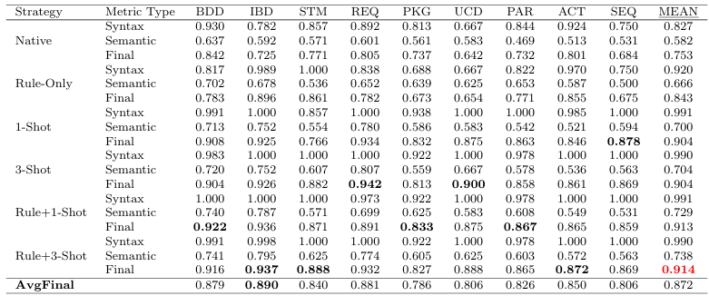
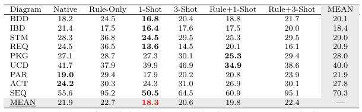

# Bridging Requirements and SysML Model Generation: A Retrieval-Augmented LLM Framework with Dataset and Evaluation

## Project Overview

This project aims to develop an automated SysML model generation system based on Prompt Engineering and Retrieval-Augmented Generation (RAG). The system consists of three core modules:

1. Dataset Initialization Module: Constructs a "Requirement-SysML Model" paired dataset from existing SysML model data. Each data entry includes a model ID, a natural language requirement description, elements of interest (i.e., the model elements to be generated), and related elements.

2. Model Generation Module: Utilizes Large Language Models (LLMs), combined with prompt engineering and RAG technology, to decompose the overall model generation task into more targeted model element generation tasks.

3. Model Evaluation Module: Automatically evaluates the generated SysML model elements from two dimensions: syntactic correctness and semantic accuracy.

## System Architecture and Core Modules

### 1. Experiment Entry Point (main.py)

- Responsible for experiment parameter configuration and overall process orchestration; serves as the main execution entry point for the system.

### 2. Experiment Management Module (code/src/experiment/)

- __generate_sysml_experiment.py__: The core experiment class, supporting multiple generation modes:

  - native: Pure LLM generation without additional enhancements.

  - rule-only: Incorporates SysML modeling rules knowledge into the prompts.
  
  - example-shots: Incorporates retrieved few-shot examples into the prompts.

  - rule-and-shots: Combines modeling rules and retrieved examples (the best practice of this system).

- __evaluate_experiment.py__:  Evaluation experiment class, used to perform syntactic and semantic evaluations.

### 3. Dataset Construction Module (code/src/database/dataset_construct/)

- __dataset_builder.py__: Supports building a standardized dataset from raw data in JSON or XMI formats, and uses LLMs to generate corresponding natural language requirement descriptions for existing models.

### 4. Evaluator Module (code/src/evaluators/)

- __syntax_evaluator/syntax_validator.py__:  XMI syntax validator ensuring generated models comply with standards of industrial tools like MagicDraw.
- __ragas/evaluator.py__: Semantic evaluator based on the RAGAS framework, measuring the alignment between generated content and requirement intent.
- __project_loader.py__: MagicDraw project loader, handling XMI file packaging and incremental updates.
- __util.py__: Provides utility functions such as semantic alignment calculation, XMI-to-graph conversion, OSS upload, etc.

### 5. Statistics and Analysis Module (code/diagrams/)

- __count_result.py__:  Performs statistical analysis on experimental results and generates visualizations.
- __count_dataset.py__ & __count_dataset_2.py__: Used for dataset statistics and feature analysis.

## Generation Examples and Comparative Analysis

### Original Data Sample

- Module ID：_17_0_5_ae502ce_1404333407063_16208_12256  

- Requirement Description: "The thruster shall incorporate a nozzle and maintain a specific impulse (Isp) value."  

- Elements of Interest: (i.e., the SysML elements to be generated)

```xml
<packagedElement xmi:type="uml:Class" xmi:id="_17_0_5_ae502ce_1404333407063_794033_12255" name="Thruster">
  <ownedAttribute xmi:type="uml:Property" xmi:id="_17_0_5_ae502ce_1404334499398_142868_12685" visibility="public" aggregation="composite" type="_17_0_5_ae502ce_1404259818876_875464_15243"/>
  <ownedAttribute xmi:type="uml:Property" xmi:id="_18_0_2_1a82048c_1420317958779_372803_52991" name="Isp" visibility="public" aggregation="composite"/>
</packagedElement>
<sysml:Block xmi:id="_17_0_5_ae502ce_1404333407063_16208_12256" base_Class="_17_0_5_ae502ce_1404333407063_794033_12255"/>
<MD_Customization_for_SysML__additional_stereotypes:ValueProperty xmi:id="_18_0_2_1a82048c_1420317958779_351432_52992" base_Property="_18_0_2_1a82048c_1420317958779_372803_52991"/>
<MD_Customization_for_SysML__additional_stereotypes:PartProperty xmi:id="_17_0_5_ae502ce_1404334499414_558638_12693" base_Property="_17_0_5_ae502ce_1404334499398_142868_12685"/>
```

- Related Elements: (Providing key type information)

```xml
<packagedElement xmi:id="_17_0_5_ae502ce_1404259818876_875464_15243" name="Nozzle" xmi:type="uml:Class"/>"
```

### Results Comparison of Different Generation Methods

  The following shows the results of generating SysML model elements corresponding to the above requirement using different methods. The comparison demonstrates that the method combining rule knowledge and Retrieval-Augmented Generation (RAG) significantly improves generation quality.  

#### 1. Native Generation

Uses only the base LLM. The output contains extraneous elements (e.g., Requirement) and does not use correct SysML paradigms (e.g., Block).

```xml
<xmi:XMI xmi:version="2.1" xmlns:xmi="http://schema.omg.org/spec/XMI/2.1" xmlns:uml="http://www.eclipse.org/uml2/5.0.0/UML">
  <uml:Model xmi:id="_model" name="ThrusterModel">
    <packagedElement xmi:id="_17_0_5_ae502ce_1404259818876_875464_15243" name="Nozzle" xmi:type="uml:Class"/>
    <packagedElement xmi:id="_thruster" name="Thruster" xmi:type="uml:Class">
      <ownedAttribute xmi:id="_nozzle_ref" name="nozzle" type="_17_0_5_ae502ce_1404259818876_875464_15243" xmi:type="uml:Property"/>
      <ownedAttribute xmi:id="_isp" name="specificImpulse" xmi:type="uml:Property">
        <type xmi:id="_Real" href="http://www.eclipse.org/uml2/5.0.0/UML/PrimitiveTypes.xmi#Real"/>
      </ownedAttribute>
    </packagedElement>
    <packagedElement xmi:id="_req" name="ThrusterRequirement" xmi:type="uml:Requirement">
      <ownedRequirement xmi:id="_req1" name="IncorporateNozzle" xmi:type="uml:Requirement">
        <clientDependency xmi:id="_dep1" supplier="_thruster" xmi:type="uml:Refinement"/>
      </ownedRequirement>
      <ownedRequirement xmi:id="_req2" name="MaintainIsp" xmi:type="uml:Requirement">
        <clientDependency xmi:id="_dep2" supplier="_thruster" xmi:type="uml:Refinement"/>
      </ownedRequirement>
    </packagedElement>
  </uml:Model>
</xmi:XMI>
```

#### 2.Rule-Enhanced (Rule-Only)

The output is more concise, begins using sysml:Block, but lacks critical stereotype information (e.g., PartProperty, ValueProperty).

```xml
<xmi:XMI xmi:version="2.1" xmlns:xmi="http://schema.omg.org/spec/XMI/2.1" xmlns:uml="http://www.eclipse.org/uml2/5.0.0/UML" xmlns:sysml="http://www.omg.org/spec/SysML/1.4/SysML">
  <packagedElement xmi:id="_thruster_block" name="Thruster" xmi:type="uml:Class">
    <ownedAttribute xmi:id="_thruster_nozzle" name="nozzle" xmi:type="uml:Property" aggregation="composite" type="_17_0_5_ae502ce_1404259818876_875464_15243"/>
    <ownedAttribute xmi:id="_thruster_isp" name="Isp" xmi:type="uml:Property">
      <type xmi:type="uml:PrimitiveType" href="http://www.omg.org/spec/UML/20131001/PrimitiveTypes.xmi#Real"/>
    </ownedAttribute>
  </packagedElement>
  <packagedElement xmi:id="_17_0_5_ae502ce_1404259818876_875464_15243" name="Nozzle" xmi:type="uml:Class"/>
</xmi:XMI>
```

#### 3.Example-Enhanced (Example-Shots)

Guided by retrieved examples. The output structure is diverse but may introduce irrelevant features from the examples (e.g., generalization).

```xml
<packagedElement xmi:type="uml:Class" xmi:id="_thruster_class_id" name="Thruster">
  <ownedAttribute xmi:type="uml:Property" xmi:id="_isp_attribute_id" name="specificImpulse" type="_primitive_type_id"/>
  <generalization xmi:type="uml:Generalization" xmi:id="_nozzle_generalization_id" general="_17_0_5_ae502ce_1404259818876_875464_15243"/>
</packagedElement>
<sysml:Block xmi:id="_thruster_block_id" base_Class="_thruster_class_id"/>
<packagedElement xmi:type="uml:PrimitiveType" xmi:id="_primitive_type_id" name="Real"/>
```

#### 4. Rule-and-Example-Enhanced (Rule-and-Shots)

The recommended method of this system. The output most closely resembles the original data, correctly using SysML stereotypes like Block, PartProperty, and ValueProperty, achieving the highest syntactic and semantic accuracy.

```xml
<packagedElement xmi:type="uml:Class" xmi:id="_thruster_1" name="Thruster">
  <ownedAttribute xmi:type="uml:Property" xmi:id="_thruster_nozzle" name="nozzle" visibility="private" aggregation="composite" type="_17_0_5_ae502ce_1404259818876_875464_15243"/>
  <ownedAttribute xmi:type="uml:Property" xmi:id="_thruster_isp" name="specificImpulse" visibility="public">
    <type href="http://www.omg.org/spec/SysML/20181001/SysML.xmi#SysML_dataType.Real"/>
  </ownedAttribute>
</packagedElement>
<sysml:Block xmi:id="_thruster_block" base_Class="_thruster_1"/>
<MD_Customization_for_SysML__additional_stereotypes:PartProperty xmi:id="_nozzle_part" base_Property="_thruster_nozzle"/>
<MD_Customization_for_SysML__additional_stereotypes:ValueProperty xmi:id="_isp_value" base_Property="_thruster_isp"/>
```

## Experimental Results

Comprehensive experimental results indicate that the method combining rule-based prompting and Retrieval-Augmented Generation (RAG) adopted in this project significantly improves both the efficiency and quality of SysML model generation.

### Comprehensive Score Comparison



(Caption: Comparison of comprehensive scores across different generation methods on evaluation metrics such as syntactic correctness and semantic fidelity. The rule-and-shots method shows clear advantages.)

### Generation Time Comparison



(Caption: Comparison of average generation time across different methods. The rule-and-shots method effectively reduces LLM reasoning time.)
